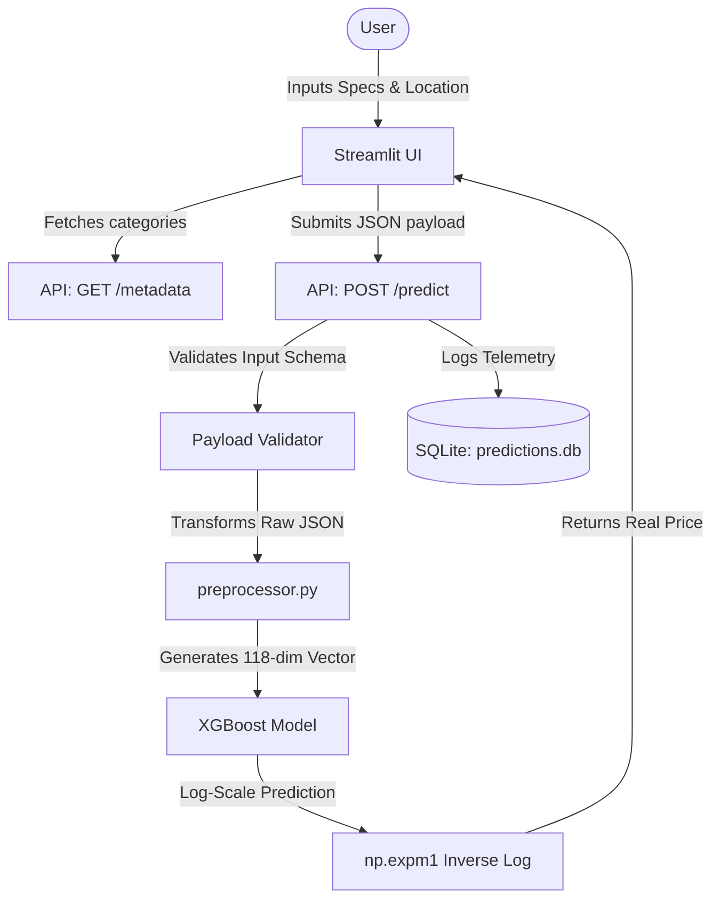

# End-to-End Property Valuation API: Real Estate Price Predictor

This portfolio project implements a production-grade, end-to-end machine learning pipeline for predicting house prices in Indonesia based on web-scraped data from the **Pinhome** platform. 

It is designed with decoupled frontend-backend components, input validation, robust dynamic feature preprocessing, automated testing, and a prediction logging system for database telemetry.

---

## 🏗️ System Architecture & Workflow

The application consists of three primary layers:
1. **Frontend (Streamlit)**: A clean user interface that queries model metadata, collects user specifications, and communicates with the backend via structured JSON payloads.
2. **Backend (Flask + Gunicorn)**: A REST API that handles endpoint routing, request validation, and features mapping.
3. **Database (SQLite Telemetry)**: An integrated local database storing logs of all requests (input features, predicted prices, and inference latency) to enable performance and data drift monitoring.



---

## 📈 Model Performance & Optimization

The target variable (`Harga`) has a highly skewed right-tail distribution, which was normalized using a log-transformation ($y_{log} = \ln(y + 1)$). Predictions are converted back using an inverse-log transform ($y = e^{y_{log}} - 1$).

During training, we evaluated **Random Forest** and **XGBoost** regressors, tuning hyperparameters with **GridSearchCV** and **Bayesian Optimization**.

### Model Evaluation Summary

| Model | MAE (Mean Error) | MedAE (Median Error) | Tuning Method | Target Transformation |
| :--- | :--- | :--- | :--- | :--- |
| Random Forest (Base) | Rp 1,095,390,772 | Rp 256,506,755 | RandomizedSearchCV | None |
| XGBoost (Base) | Rp 475,249,784 | Rp 228,242,560 | Default | None |
| XGBoost (Tuned) | Rp 447,217,384 | Rp 203,831,600 | **Bayesian Optimization** | **Log-Transformed** ($np.log1p$) |

* **Final Model Selection**: The log-transformed XGBoost optimized via Bayesian Optimization achieved the lowest MAE (Rp 447M) and MedAE (Rp 203M) and is packaged as `xgb_model.joblib`.

---

## 🔌 API Documentation

### 1. GET `/metadata`
Retrieves lists of locations and conditions supported by the trained model. Used by the client to render dropdowns dynamically.

* **Response (200 OK)**:
  ```json
  {
    "status": "success",
    "locations": ["Kab. Bandung", "Kota Bekasi", "Kota Depok", "..."],
    "conditions": ["Baru", "Second", "Tidak diketahui"]
  }
  ```

### 2. POST `/predict`
Calculates property valuation estimates.

* **Request Body (JSON)**:
  ```json
  {
    "kamar_tidur": 3,
    "kamar_mandi": 2,
    "luas_tanah": 120.0,
    "luas_bangunan": 100.0,
    "lokasi": "Kota Depok",
    "kondisi": "Second"
  }
  ```
* **Success Response (200 OK)**:
  ```json
  {
    "status": "success",
    "estimasi_harga": 1250000000.0,
    "latency_ms": 12.34
  }
  ```
* **Validation Error (400 Bad Request)**:
  ```json
  {
    "status": "validation_error",
    "message": "luas_tanah harus lebih besar dari 0."
  }
  ```

---

## 🗄️ Database Telemetry (Monitoring)
Every prediction request is recorded in `predictions.db` (SQLite) inside the `prediction_logs` table:
* `timestamp`: Date and time of request.
* `kamar_tidur`, `kamar_mandi`, `luas_tanah`, `luas_bangunan`, `lokasi`, `kondisi`: Features submitted.
* `predicted_price`: Model valuation output.
* `latency_ms`: Time taken by backend to validate, preprocess, and predict.

This dataset can be used to query query volumes, analyze average latencies, or check for input feature drift.

---

## ⚙️ How to Run Locally

### Prerequisites
* Python 3.8 or higher

### 1. Setup Environment & Dependencies
```bash
# Clone and enter the workspace
cd pinhome-price-api

# Create a virtual environment
python -m venv venv
source venv/bin/activate  # On Windows: venv\Scripts\activate

# Install dependencies
pip install -r requirements.txt
```

### 2. Run the Backend API
```bash
python app.py
```
The server will start at `http://localhost:5000`.

### 3. Run the Frontend UI
In a separate terminal:
```bash
streamlit run frontend.py
```
Open `http://localhost:8501` in your browser. Use the sidebar to toggle between Local and Production modes.

---

## 🧪 Running Unit Tests

To verify that the preprocessing vectors map correctly and the API endpoints function without issues:
```bash
python test_app.py
```
*(Tests run natively using Python's built-in `unittest` module without requiring external runner dependencies).*
